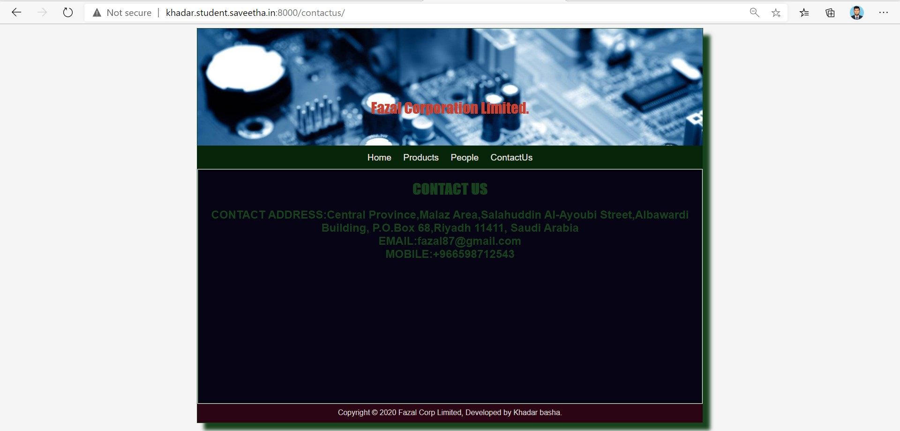

# Web Design for a Manufacturing Company
## AIM: 
To design a static website for a chip manufacturing company.

## DESIGN STEPS:
### Step 1: 
Requirement collection.
### Step 2:
Creating the layout using HTML and CSS.
### Step 3:
Updating the sample content.
### Step 4:
Choose the appropriate style and color scheme.
### Step 5:
Validate the layout in various browsers.
### Step 6:
Validate the HTML code.
### Step 6:
Publish the website in the given URL.

## PROGRAM:

### base.html
```

<!DOCTYPE html>
<html lang="en">

<head>
    <title>Silicon Private Limited</title>
    <link rel="stylesheet" href="">
    <link rel = "icon" href ="" type = "image/x-icon"> 
              
</head>

<body>
    <div class="container">
    <div class="banner">
        Silicon Private Limited.
    </div>
    <div class="menu">
        <div class="menuitem"><a href="/home">Home</a></div> 
        <div class="menuitem"><a href="/products">Products</a></div> 
        <div class="menuitem"><a>People</a></div>
        <div class="menuitem"><a>Contact Us</a></div> 
    </div><div class="content">
        
    
    </div>
    <div class="footer">
        Copyright © 2020 Silicon Private Limited, Developed by Obed Otto.
    </div>
    </div>
</body>

</html>
```

### home.html
```



    <div class="homecontent">    
    <h1>About Us</h1>
    
    <div class="contenttext">
    Silicon Pvt Ltd, provides a broad range of semiconductor and infrastructure software applications. Some of Silicon's core technologies and products include:
    <ul>
        <li>Memory Chips</li>
        <li>SATA HDD</li>
        <li>SATA SSD </li>
        <li>Broadband Modems</li>
        <li>Wifi Devices</li>
        <li>Switching Devices</li>
        <li>Optical Sensors</li>
    </ul> 
    </div>
    </div>

```
### products.html
```



    <div class="productcontent">    
    <h1>Our Premium Products</h1>
    <div class="productitems">
        <div class="productitem"> 
            <div class="itemimage">
            
            </div>
            <div class="itemname">4GB DDRA4 laptop memory</div>
            <div class="itemprice">Price: Rs.2000.00 </div>
        </div>
        <div class="productitem"> 
            <div class="itemimage">
            
            </div>
            <div class="itemname">1TB Laptop HDD</div>
            <div class="itemprice">Price: Rs.5000.00 </div>
        </div>
         <div class="productitem"> 
            <div class="itemimage">
            
            </div>
            <div class="itemname">AMEGON 4GB DDR3 </div>
            <div class="itemprice">Price: Rs.1500.00 </div>
        </div>
         <div class="productitem"> 
            <div class="itemimage">
            
            </div>
            <div class="itemname">Intel Core i3-9100F 9th Gen</div>
            <div class="itemprice">Price: Rs.7000.00 </div>
        </div>
         <div class="productitem"> 
            <div class="itemimage">
            
            </div>
            <div class="itemname">Kingston SSDNow A400 240GB</div>
            <div class="itemprice">Price: Rs.2700.00 </div>
        </div>
         <div class="productitem"> 
            <div class="itemimage">
            
            </div>
            <div class="itemname">Crucial BX500 480GB 3D NAND SATA 2.5-inch SSD</div>
            <div class="itemprice">Price: Rs.4300.00 </div>
        </div>
         <div class="productitem"> 
            <div class="itemimage">
            
            </div>
            <div class="itemname">Corsair CV650</div>
            <div class="itemprice">Price: Rs.5500.00 </div>
        </div>
         <div class="productitem"> 
            <div class="itemimage">
            
            </div>
            <div class="itemname">Corsair RM650</div>
            <div class="itemprice">Price: Rs.10500.00 </div>
        </div>
         <div class="productitem"> 
            <div class="itemimage">
            
            </div>
            <div class="itemname">Antec NeoEco 650M</div>
            <div class="itemprice">Price: Rs.4600.00 </div>
        </div>
         <div class="productitem"> 
            <div class="itemimage">
            
            </div>
            <div class="itemname">D-Link DSL-2730U Wireless-N 150 ADSL2+ 4-Port Router</div>
            <div class="itemprice">Price: Rs.1000.00 </div>
        </div>
         <div class="productitem"> 
            <div class="itemimage">
            
            </div>
            <div class="itemname">TP-LINK TD-W8961N Wireless</div>
            <div class="itemprice">Price: Rs.1200.00 </div>
        </div>
         <div class="productitem"> 
            <div class="itemimage">
            
            </div>
            <div class="itemname"> TP-Link Archer T3U AC1300 Mini Wireless MU-MIMO USB Adapter</div>
            <div class="itemprice">Price: Rs.1500.00 </div>
        </div>
    </div>
    </div>

```
## people.html:
```



        <div class="peoplecontent">    
    <h1>OUR EXECUTIVE LEADERSHIP TEAM</h1>
    <div class="peoplelists">
        <div class="peoplelist"> 
            <div class="peopleimage">
            
            </div>
            <div class="peoplename">
                <h2>FAZAL</h2></div>
            <div class="peoplepost">
                <h3>(C.E.O)</h3></div>
        </div>
        <div class="peoplelists">
        <div class="peoplelist"> 
            <div class="itemimage">
            
            </div>
            <div class="peoplename">
                <h2>Martin</h2></div>
            <div class="peoplepost">
                <h3>(SENIOR VICE PRESIDENT)</h3></div>
        </div>
         <div class="peoplelists">
        <div class="peoplelist"> 
            <div class="itemimage">
            
            </div>
            <div class="peoplename">
                <h2>JONATHAN IVE</h2></div>
            <div class="peoplepost">
                <h3>(CHEIF DESIGNER OFFICER)</h3></div>
        </div>
         <div class="peoplelists">
        <div class="peoplelist"> 
            <div class="itemimage">
            
            </div>
            <div class="itemname">
                <h2>JEFF WILLIAMS</h2></div>
            <div class="itemprice">
                <h3>(CHEIF OPERATING OFFICER)</h3></div>
        </div>
         <div class="peoplelists">
        <div class="peoplelist"> 
            <div class="itemimage">
            
            </div>
            <div class="peoplename">
                <h2>DAVID</h2></div>
            <div class="peoplepost">
                <h3>(VICE PRESIDENT MARKETING)</h3></div>
        </div>
         <div class="peoplelists">
        <div class="peoplelist"> 
            <div class="itemimage">
            
            </div>
            <div class="itemname">
                <h2>DAN</h2></div>
            <div class="itemprice">
                <h3>(VICE PRESIDENT HARDWARE TECHNOLOGY)</h3></div>
        </div>

```
## contactus.html:
```



<div class="content1">
    <h1 class="contactcenter">
        CONTACT US</h1>
    <h2 class="contactcenter">
        CONTACT ADDRESS:Central Province,Malaz Area,Salahuddin Al-Ayoubi Street,Albawardi Building, P.O.Box 68,Riyadh
        11411, Saudi Arabia
        <br>
        EMAIL:fazal87@gmail.com
        <br>
        MOBILE:+966598712543
    </h2>
</div>


```    

## OUTPUT:




## CODE VALIDATION REPORT:


## RESULT:
Thus a website is designed for the chip manufacturing company and is hosted in the URL http://khadar.student.saveetha.in:8000/. HTML code is validated.